# AWS Networking & Three-Tier Architecture Guide
## Route 53 & DNS-Based Traffic Management

**Enterprise Cloud Infrastructure Implementation Guide | Version 2.0 | 2025**

---

## Table of Contents

**AWS NETWORKING FOUNDATIONS**

| Task | Topic | Page |
|------|-------|------|
| 01 | Introduction to AWS Networking | 1 |
| TASK 1 | Virtual Private Cloud (VPC) — Components, CIDR, Default vs Custom | 3 |
| TASK 3 | Subnets and CIDR Blocks — Public, Private, Database Subnets | 4 |
| TASK 4 | Internet Gateway (IGW) — Internet Traffic Flow, Route Config | 7 |
| TASK 5 | NAT Gateway — Outbound Access, Elastic IP | 9 |
| TASK 6 | Security Groups — Stateful Firewall, SG Chaining | 11 |
| TASK 7 | Route Tables — Local, Internet, NAT Routes | 13 |

**LOAD BALANCING & SCALING**

| Task | Topic | Page |
|------|-------|------|
| TASK 9 | Launch Templates — AMI, Instance Type, UserData | 17 |
| TASK 10 | Auto Scaling Group (ASG) — Self-Healing, Scaling Policies | 18 |
| TASK 11A | Path-Based Routing — URL Path Prefix Routing | 20 |
| TASK 11B | Host-Based Routing — HTTP Host Header Routing | 22 |
| TASK 11D | HTTP Request Method Routing — GET vs POST/PUT/DELETE | 24 |
| TASK 12 | AWS Certificate Manager (ACM) — SSL/TLS, DNS Validation | 26 |

**THREE-TIER ARCHITECTURE**

| Task | Topic | Page |
|------|-------|------|
| TASK 13 | Three-Tier Architecture Implementation — Web Tier, App Tier, Database Tier | 28 |
| TASK 13 | Three-Tier: Step-by-Step Implementation — Phase 1–3 Full Deployment | 30 |

**ROUTE 53 & DNS MANAGEMENT**

| Section | Topic | Page |
|---------|-------|------|
| 16 | AWS Route 53 & DNS Management — A Comprehensive Guide | 32 |
| 17 | Route 53 Concepts Deep Dive — Hosted Zones, Records, TTL | 33 |
| 18 | Route 53 Routing Policies — All 7 Routing Policies Compared | 35 |
| 19 | Practical Implementation — Route 53 Tasks R1 through R8 | 36 |
| 20 | Complete Production Architecture — Route 53 → ALB → VPC → ASG | 44 |

---

## 01 — Introduction to AWS Networking

### What is Cloud Networking?

Cloud networking refers to the delivery of networking capabilities — such as routing, load balancing, firewall rules, DNS, and VPN connectivity — as virtualized services hosted and managed by a cloud provider. In AWS, these capabilities are exposed through managed services like Amazon VPC, Elastic Load Balancing, AWS Direct Connect, Amazon Route 53, and AWS Transit Gateway.

**Table 1.1 — Traditional vs AWS Networking Comparison**

| Attribute | Traditional Networking | AWS Cloud Networking |
|-----------|----------------------|---------------------|
| Infrastructure | Physical routers, switches, cables | Virtualized, software-defined |
| Provisioning | Days to weeks | Minutes via API / Console |
| Scalability | Manual hardware upgrades | Elastic and automatic |
| Cost model | CapEx — upfront hardware | OpEx — pay-as-you-go |
| Security | Physical firewall appliances | Security Groups, NACLs, WAF |
| Redundancy | Manual failover configs | Built-in Multi-AZ / Multi-Region |
| Visibility | SNMP, syslog | VPC Flow Logs, CloudWatch, X-Ray |

### Why Networking is Critical in AWS

- **Security isolation:** VPCs separate workloads and prevent unauthorized cross-traffic.
- **Performance:** Proper routing and placement in the right AZ minimizes latency.
- **High Availability:** Multi-AZ architectures require subnets and route tables in each AZ.
- **Cost efficiency:** Misrouted traffic (cross-AZ or internet egress) incurs unexpected costs.
- **Compliance:** Regulated industries require network segmentation and audit trails.

### How AWS Networking Works Internally

At the physical layer, AWS operates a massive global network of data centres interconnected by a proprietary high-speed backbone. The Nitro System hypervisor provides hardware virtualisation and networking offload, enabling Enhanced Networking (up to 100 Gbps) and Elastic Fabric Adapter (EFA) for HPC workloads. Each AWS Region consists of multiple, geographically separated Availability Zones (AZs). Within a Region, all AZs are connected by low-latency, high-bandwidth private links.

> **Note:** AWS networking is entirely software-defined. There is no concept of subnets spanning multiple Availability Zones — each subnet resides in exactly one AZ.

---

## TASK 1 — Virtual Private Cloud (VPC)
### Components, CIDR, Default vs Custom, DNS Settings

### Theory: What is a VPC?

Amazon Virtual Private Cloud (Amazon VPC) lets you provision a logically isolated section of the AWS Cloud where you can launch AWS resources in a virtual network that you define completely. You have full control over your virtual networking environment, including selection of your own IP address range, creation of subnets, configuration of route tables, and setup of network gateways. A VPC is regional — it spans all Availability Zones within a single AWS Region but does not cross Region boundaries.

### VPC Components

**Table 2.1 — VPC Core Components**

| Component | Description |
|-----------|-------------|
| CIDR Block | Defines the IP address range of the VPC (e.g., 10.0.0.0/16) |
| Subnets | Sub-divisions of the VPC CIDR, each associated with one AZ |
| Internet Gateway | Enables communication between VPC resources and the internet |
| NAT Gateway | Allows private instances to initiate outbound internet connections |
| Route Tables | Define routing rules for subnets within the VPC |
| Security Groups | Virtual firewalls at the instance level (stateful) |
| Network ACLs | Subnet-level firewall (stateless) |
| VPC Endpoints | Private connectivity to AWS services without internet |
| DHCP Options | Custom DNS and NTP settings for instances |
| Elastic IP | Static public IPv4 address associated with your account |

### CIDR Block Explanation

CIDR (Classless Inter-Domain Routing) notation expresses an IP address range. The notation /16 means the first 16 bits are the network portion, leaving 16 bits for host addresses — yielding 65,536 possible IP addresses. AWS recommends using RFC 1918 private IP ranges:

**Table 2.2 — RFC 1918 Private IP Ranges**

| RFC 1918 Range | CIDR Notation | Total IPs | Recommended Use |
|----------------|---------------|-----------|-----------------|
| 10.0.0.0 – 10.255.255.255 | 10.0.0.0/8 | 16,777,216 | Large enterprise networks |
| 172.16.0.0 – 172.31.255.255 | 172.16.0.0/12 | 1,048,576 | Medium networks |
| 192.168.0.0 – 192.168.255.255 | 192.168.0.0/16 | 65,536 | Small / lab networks |

### Default VPC vs Custom VPC

- **Default VPC:** Every AWS account gets one default VPC per Region (172.31.0.0/16). It comes pre-configured with a default subnet in each AZ, an attached Internet Gateway, and a default route table. Instances launched here get public IP addresses by default.
- **Custom VPC:** You create and fully control the networking configuration. No internet connectivity exists until you explicitly add an IGW, configure subnets, and set up route tables. Recommended for all production workloads.

### Practical Implementation — AWS Console

| # | Step | Action / Detail |
|---|------|-----------------|
| 1 | Navigate to VPC | Log in to AWS Console → Search 'VPC' → Click Your VPCs |
| 2 | Create VPC | Click Create VPC → Select VPC only option |
| 3 | Name Tag | Enter Name: prod-vpc |
| 4 | IPv4 CIDR | Set IPv4 CIDR block to 10.0.0.0/16 |
| 5 | Tenancy | Set Tenancy to Default (shared hardware) |
| 6 | DNS Hostnames | After creation → Actions → Edit VPC settings → Enable DNS hostnames |
| 7 | DNS Resolution | Verify DNS resolution is enabled (enabled by default) |
| 8 | Create | Click Create VPC — VPC is now created with ID vpc-xxxxxxxx |

> **Note:** Always enable DNS hostnames and DNS resolution on custom VPCs. This is required for services like EKS, ECS, and RDS to function correctly.

### Architecture Diagram

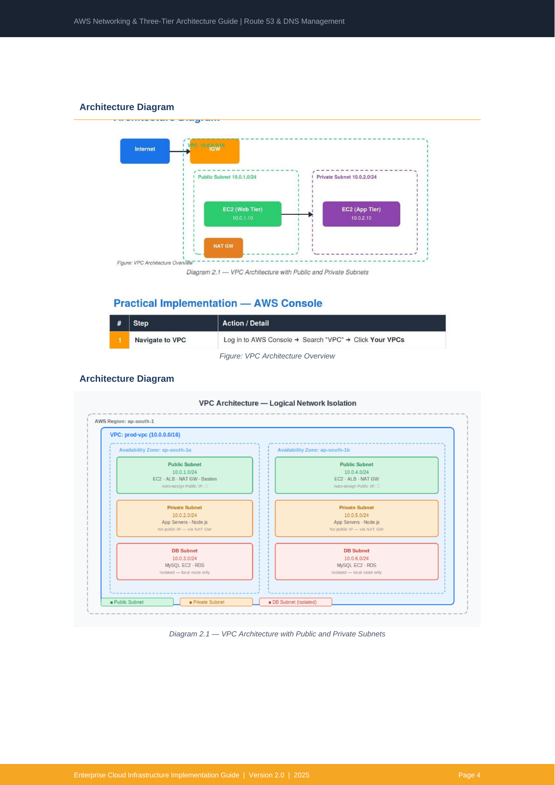

*Diagram 2.1 — VPC Architecture with Public and Private Subnets*

---

## TASK 3 — Subnets and CIDR Blocks
### Public, Private, Database Subnets, AZ Layout

### Theory: Understanding Subnets

A subnet is a range of IP addresses within your VPC. Resources such as EC2 instances, RDS databases, and Lambda functions are always launched into a specific subnet. The subnet determines which Availability Zone the resource resides in, whether it receives a public IP, and which route table governs its outbound traffic. Good subnet design is the cornerstone of a secure, highly available AWS architecture.

**Table 4.1 — Subnet Types and Characteristics**

| Subnet Type | Route Table Target | Public IP | Typical Resources |
|-------------|-------------------|-----------|-------------------|
| Public Subnet | Internet Gateway (0.0.0.0/0 → igw-xxx) | Yes | ALB, NAT GW, Bastion, NGINX |
| Private Subnet | NAT Gateway (0.0.0.0/0 → nat-xxx) | No | App servers, Node.js, Java |
| Database Subnet | Local only (no internet) | No | RDS, ElastiCache, DynamoDB |
| Isolated Subnet | Local route only | No | Highly sensitive workloads |

### AWS Reserved IP Addresses

AWS reserves the first 4 and last 1 IP addresses in every subnet:

**Table 4.2 — AWS Reserved IPs in a /24 Subnet**

| IP Address | Purpose |
|------------|---------|
| 10.0.1.0 | Network address (not usable) |
| 10.0.1.1 | Reserved by AWS for VPC router |
| 10.0.1.2 | Reserved for AWS DNS server |
| 10.0.1.3 | Reserved for future use |
| 10.0.1.255 | Broadcast address (not usable) |

### Practical Implementation — AWS Console

| # | Step | Action / Detail |
|---|------|-----------------|
| 1 | VPC Console | Navigate to VPC → Subnets → Create Subnet |
| 2 | Select VPC | Choose prod-vpc from the dropdown |
| 3 | Subnet Name | Name: public-subnet-1a |
| 4 | Select AZ | Availability Zone: ap-south-1a |
| 5 | CIDR Block | IPv4 CIDR block: 10.0.1.0/24 (251 usable IPs) |
| 6 | Create | Click Create Subnet |
| 7 | Enable Public IP | Select subnet → Actions → Edit subnet settings → Enable auto-assign public IPv4 address |
| 8 | Repeat for AZ2 | Create public-subnet-1b in ap-south-1b with CIDR 10.0.4.0/24 |

**Table 4.3 — Complete Subnet Configuration Plan**

| Subnet Name | CIDR | AZ | Type | Auto Public IP |
|-------------|------|-----|------|----------------|
| public-subnet-1a | 10.0.1.0/24 | ap-south-1a | Public | Yes |
| public-subnet-1b | 10.0.4.0/24 | ap-south-1b | Public | Yes |
| private-subnet-1a | 10.0.2.0/24 | ap-south-1a | Private | No |
| private-subnet-1b | 10.0.5.0/24 | ap-south-1b | Private | No |
| db-subnet-1a | 10.0.3.0/24 | ap-south-1a | Database | No |
| db-subnet-1b | 10.0.6.0/24 | ap-south-1b | Database | No |

### Architecture Diagram

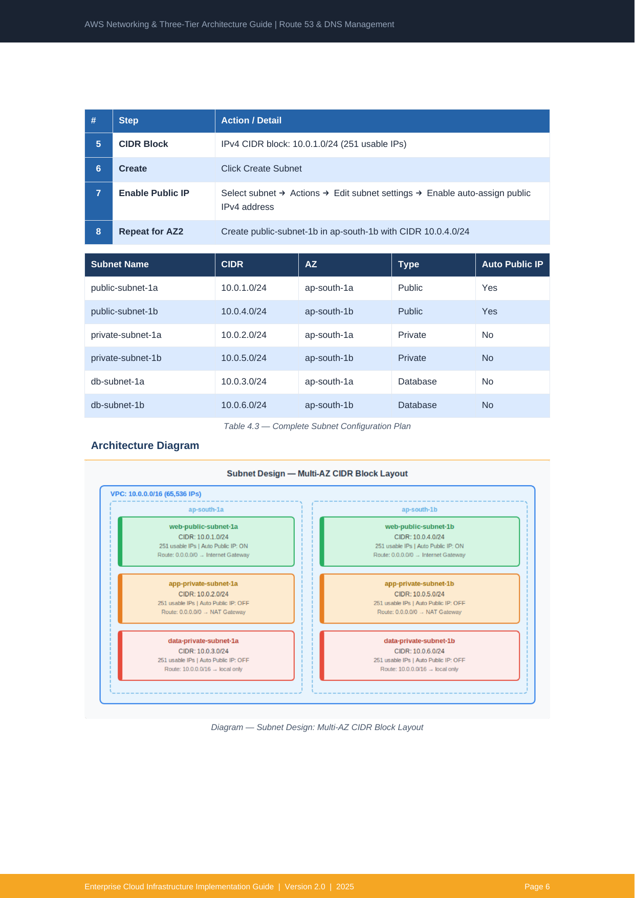

*Diagram — Subnet Design: Multi-AZ CIDR Block Layout*

---

## TASK 4 — Internet Gateway (IGW)
### Internet Traffic Flow, Route Configuration

### Theory: Internet Gateway

An Internet Gateway (IGW) serves two purposes: it provides a target in your VPC route tables for internet-routable traffic, and it performs network address translation (NAT) for instances that have been assigned public IPv4 addresses. An IGW supports IPv4 and IPv6 traffic. It is horizontally scaled, redundant, and highly available — there is no bandwidth bottleneck or single point of failure. Only one IGW can be attached to a VPC at any time.

### Practical Implementation — AWS Console

| # | Step | Action / Detail |
|---|------|-----------------|
| 1 | Create IGW | VPC Console → Internet Gateways → Create internet gateway |
| 2 | Name | Name tag: prod-igw → Click Create |
| 3 | Attach to VPC | Select the IGW → Actions → Attach to VPC → Choose prod-vpc → Attach |
| 4 | Open Route Tables | Navigate to VPC → Route Tables |
| 5 | Create Public RT | Click Create route table → Name: public-rt → VPC: prod-vpc |
| 6 | Add IGW Route | Select public-rt → Routes tab → Edit routes → Add route: Destination: 0.0.0.0/0 → Target: prod-igw |
| 7 | Associate Subnets | Subnet Associations tab → Edit → Select public-subnet-1a and 1b |
| 8 | Verify | Launch EC2 in public subnet → verify outbound internet works via `curl ifconfig.me` |

### Architecture Diagram

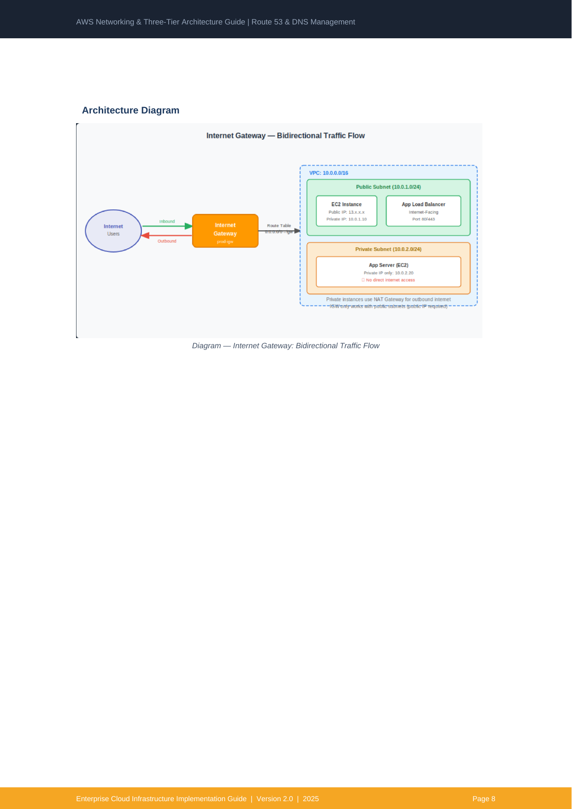

*Diagram — Internet Gateway: Bidirectional Traffic Flow*

---

## TASK 5 — NAT Gateway
### Outbound Access, Elastic IP, Private Route Table

### Theory: NAT Gateway

Network Address Translation (NAT) Gateway is a managed AWS service that allows EC2 instances in private subnets to initiate outbound traffic to the internet while preventing the internet from initiating connections to those instances. The NAT Gateway is placed in a public subnet and uses an Elastic IP (EIP) address as its source IP for outbound traffic. Private instances route their internet-bound traffic through the NAT GW, which then forwards it through the Internet Gateway.

### Practical Implementation — AWS Console

| # | Step | Action / Detail |
|---|------|-----------------|
| 1 | Allocate Elastic IP | VPC Console → Elastic IPs → Allocate Elastic IP address → Allocate |
| 2 | Create NAT GW | VPC → NAT Gateways → Create NAT gateway |
| 3 | Configure NAT | Name: prod-nat-gw → Subnet: public-subnet-1a → Connectivity: Public → Elastic IP: select allocated EIP |
| 4 | Create | Click Create — wait ~2 minutes for Status: Available |
| 5 | Update Private RT | Route Tables → select private-rt (or create one) |
| 6 | Add NAT Route | Edit routes → Add: Destination 0.0.0.0/0 → Target: prod-nat-gw |
| 7 | Associate Subnets | Associate private-subnet-1a and private-subnet-1b to private-rt |
| 8 | Verify | SSH into private EC2 via bastion → run: `curl https://checkip.amazonaws.com` |

> **Note:** For high availability, deploy a NAT Gateway in each Availability Zone and update each AZ's private route table to use the local NAT Gateway. This prevents cross-AZ traffic charges and ensures resilience if one AZ fails.

**Table 6.1 — NAT Gateway Configuration**

| Configuration | Value |
|---------------|-------|
| NAT Gateway Name | prod-nat-gw |
| Placement | public-subnet-1a (must be in public subnet) |
| Connectivity Type | Public |
| Elastic IP | Auto-allocated EIP (e.g., 13.234.56.78) |
| Private RT route | 0.0.0.0/0 → nat-xxxxxxxxxxxxxxxxx |

### Architecture Diagram

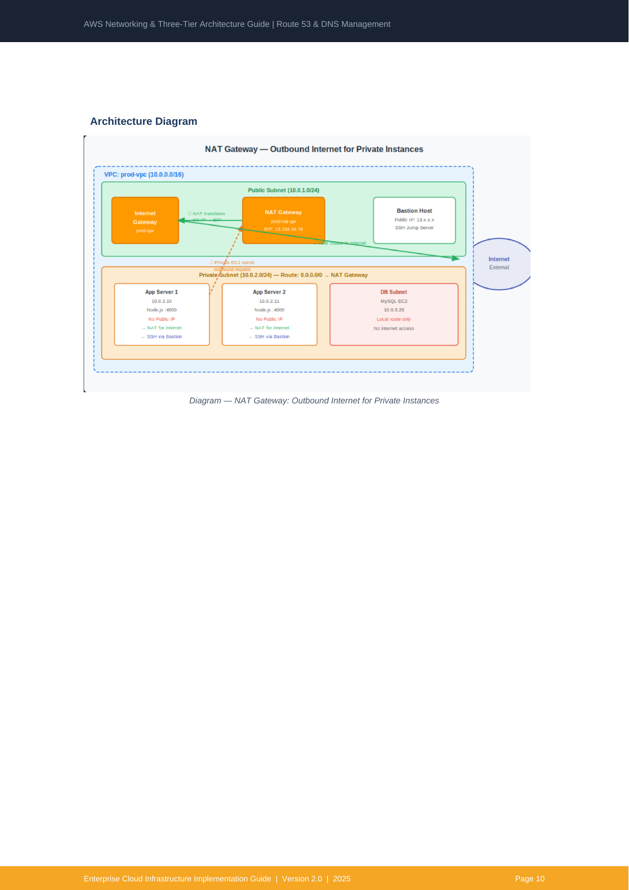

*Diagram — NAT Gateway: Outbound Internet for Private Instances*

---

## TASK 6 — Security Groups
### Stateful Firewall, Inbound/Outbound, SG Chaining

### Theory: Security Groups

A Security Group is a set of firewall rules that controls the traffic for one or more EC2 instances (or other AWS resources). Security Groups are stateful — if you allow inbound traffic on port 80, the response traffic is automatically allowed outbound without needing an explicit outbound rule. All inbound traffic is denied by default; all outbound traffic is allowed by default.

### Practical Implementation — AWS Console

| # | Step | Action / Detail |
|---|------|-----------------|
| 1 | Navigate | EC2 Console (or VPC Console) → Security Groups → Create security group |
| 2 | Basic Info | Name: web-tier-sg → Description: Web Tier Security Group → VPC: prod-vpc |
| 3 | Inbound Rules | Add rule: Type=HTTP, Port=80, Source=0.0.0.0/0 \| Add rule: Type=HTTPS, Port=443, Source=0.0.0.0/0 |
| 4 | SSH Rule | Add rule: Type=SSH, Port=22, Source=bastion-sg (SG reference, not CIDR) |
| 5 | Outbound Rules | Default: All traffic → 0.0.0.0/0 (keep as-is) |
| 6 | Create | Click Create security group |

**Table 7.2 — Security Groups for Three-Tier Architecture**

| SG Name | Inbound Rules | Purpose |
|---------|---------------|---------|
| alb-sg | 80, 443 from 0.0.0.0/0 | Public ALB |
| web-sg | 80 from alb-sg, 22 from bastion-sg | NGINX web tier |
| internal-alb-sg | 80 from web-sg | Internal ALB |
| app-sg | 3000 from internal-alb-sg, 22 from bastion-sg | App tier (Node.js) |
| db-sg | 3306 from app-sg | MySQL EC2 (Self-Managed) |
| bastion-sg | 22 from your IP only | Bastion Host |

### Architecture Diagram

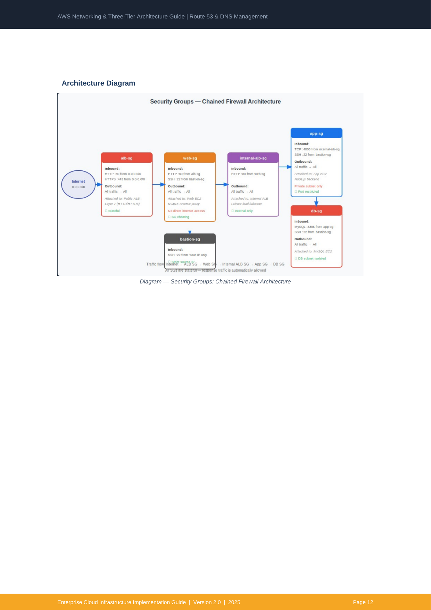

*Diagram — Security Groups: Chained Firewall Architecture*

---

## TASK 7 — Route Tables
### Local, Internet, NAT Routes, Subnet Association

### Theory: Route Tables

Every subnet in a VPC must be associated with a route table that controls outbound routing for the subnet. A VPC has one implicit main route table, which all subnets use by default unless explicitly associated with a custom route table. Routes are evaluated by longest prefix match — the most specific route wins.

### Practical Implementation — AWS Console

| # | Step | Action / Detail |
|---|------|-----------------|
| 1 | Create Public RT | VPC → Route Tables → Create route table → Name: public-rt → VPC: prod-vpc |
| 2 | Add IGW Route | Routes → Edit → Add route: 0.0.0.0/0 → Target: prod-igw |
| 3 | Associate Public Subnets | Subnet Associations → Edit → Select public-subnet-1a, public-subnet-1b |
| 4 | Create Private RT | Create route table → Name: private-rt → VPC: prod-vpc |
| 5 | Add NAT Route | Routes → Edit → Add route: 0.0.0.0/0 → Target: prod-nat-gw |
| 6 | Associate Private Subnets | Subnet Associations → Edit → Select private-subnet-1a, private-subnet-1b |
| 7 | Create DB RT | Create route table → Name: db-rt → VPC: prod-vpc (only local route) |
| 8 | Associate DB Subnets | Associate db-subnet-1a, db-subnet-1b to db-rt |

### Architecture Diagram

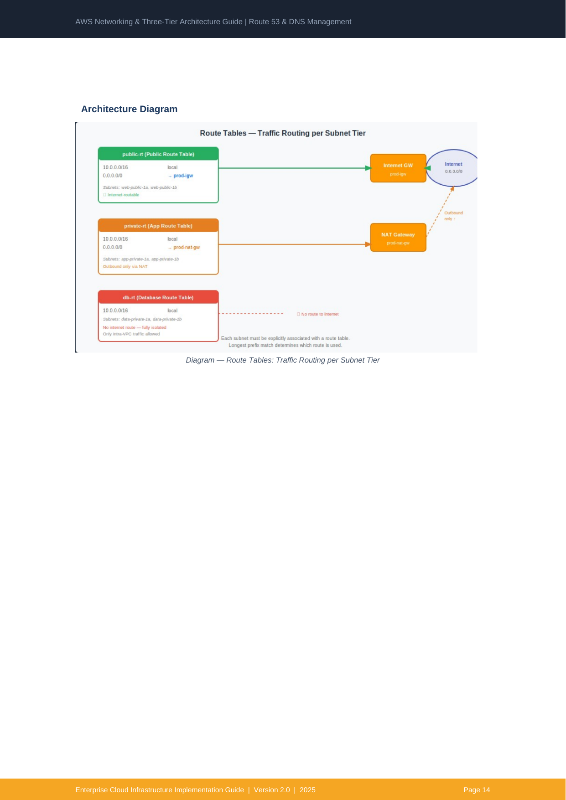

*Diagram — Route Tables: Traffic Routing per Subnet Tier*

---

## TASK 9 — Launch Templates
### AMI, Instance Type, UserData, Security Groups

### Theory: Launch Templates

A Launch Template captures all instance configuration parameters — AMI ID, instance type, key pair, security groups, storage, IAM role, user data scripts, and network settings — in a versioned, reusable template. Auto Scaling Groups reference launch templates to provision new instances automatically. Launch templates also support mixed instance policies for Spot and On-Demand combinations.

### Practical Implementation — AWS Console

| # | Step | Action / Detail |
|---|------|-----------------|
| 1 | Navigate | EC2 Console → Launch Templates → Create launch template |
| 2 | Name | Template name: web-tier-lt → Description: Web Tier NGINX |
| 3 | AMI | Click Browse → Select Amazon Linux 2023 AMI (free tier eligible) |
| 4 | Instance Type | Select t3.micro (or t3.small for production) |
| 5 | Key Pair | Select existing key pair or create new: prod-keypair |
| 6 | Network | Do NOT specify subnet here (ASG will handle placement) |
| 7 | Security Group | Select web-sg from dropdown |
| 8 | Storage | Root volume: 20 GiB gp3 (default 8 GiB is sufficient for NGINX) |
| 9 | UserData | Advanced → User data → paste the NGINX bootstrap script |
| 10 | Create | Click Create launch template |

**Table 10.1 — Launch Template Parameters for Web and App Tiers**

| Parameter | Web Tier | App Tier |
|-----------|----------|----------|
| Template Name | web-tier-lt | app-tier-lt |
| AMI | Amazon Linux 2023 | Amazon Linux 2023 |
| Instance Type | t3.micro | t3.small |
| Security Group | web-sg | app-sg |
| UserData | NGINX install + config | Node.js install + app start |
| IAM Role | ec2-ssm-role | ec2-ssm-role |

---

## TASK 10 — Auto Scaling Group (ASG)
### Self-Healing, Scaling Policies, Desired Capacity

### Theory: Auto Scaling Group

An Auto Scaling Group (ASG) is a collection of EC2 instances treated as a logical grouping for automatic scaling and management. The ASG continuously checks the health of instances, replacing any that become unhealthy. You define the minimum, maximum, and desired capacity. Scaling policies (Target Tracking, Step Scaling, Scheduled) adjust capacity based on demand. ASGs integrate natively with Application Load Balancers through Target Groups.

### Practical Implementation — AWS Console

| # | Step | Action / Detail |
|---|------|-----------------|
| 1 | Navigate | EC2 Console → Auto Scaling Groups → Create Auto Scaling group |
| 2 | Name | Name: web-asg |
| 3 | Launch Template | Select web-tier-lt → Latest version |
| 4 | Network | VPC: prod-vpc → Subnets: public-subnet-1a, public-subnet-1b |
| 5 | Load Balancer | Attach to existing load balancer → Target group: web-tg |
| 6 | Health Check | Health check type: ELB → Grace period: 300 seconds |
| 7 | Capacity | Desired: 2 → Minimum: 2 → Maximum: 6 |
| 8 | Scaling Policy | Target tracking → Metric: Average CPU Utilization → Target: 70% |
| 9 | Notifications | (Optional) Add SNS topic for scale events |
| 10 | Create | Review → Create Auto Scaling group |

### Architecture Diagram

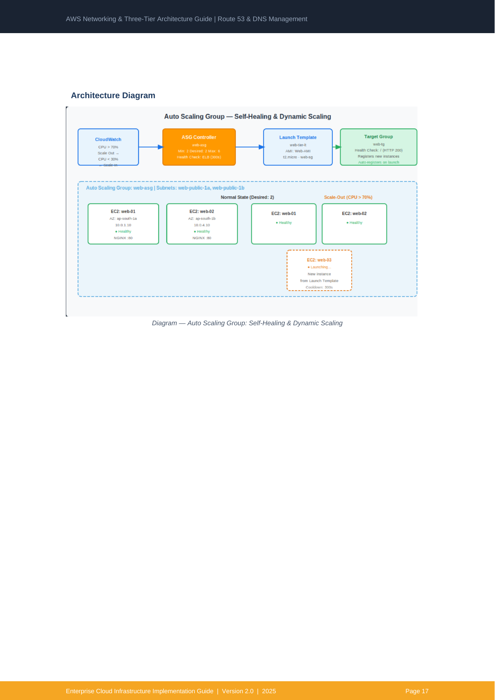

*Diagram — Auto Scaling Group: Self-Healing & Dynamic Scaling*

---

## TASK 11A — Path-Based Routing
### Route requests to different target groups based on URL path prefix

### Theory

Path-based routing directs requests to different target groups based on the URL path. This allows a single ALB to serve multiple microservices from a single entry point — no need for separate load balancers per service.

**Table 12.1 — Path-Based Routing Rules**

| Path Pattern | Target Group | Use Case | Priority |
|-------------|--------------|----------|----------|
| /api/* | api-tg | REST API microservice | 1 (highest) |
| /web/* | web-tg | Web frontend service | 2 |
| /admin/* | admin-tg | Admin dashboard service | 3 |
| /* (default) | default-tg | Fallback — catch-all | Default |

### Creating Path-Based Listener Rules

| # | Step | Action / Detail |
|---|------|-----------------|
| 1 | Open Listeners | Select ALB → Listeners tab → Click on HTTP:80 listener |
| 2 | Manage Rules | Click Manage rules → Add rule |
| 3 | Add Condition | Click + Add condition → choose Path |
| 4 | Set Path | Enter condition value: /api/* |
| 5 | Add Action | Click + Add action → Forward to → select api-tg |
| 6 | Set Priority | Set rule priority: 1 (lower number = evaluated first) |
| 7 | Repeat | Add rules for /web/* → web-tg and /admin/* → admin-tg |
| 8 | Save | Click Save → rules are now active |

### Architecture Diagram

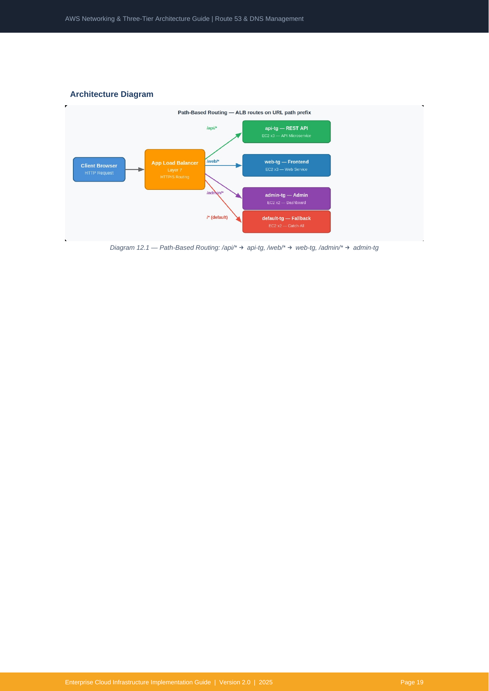

*Diagram 12.1 — Path-Based Routing: /api/\* → api-tg, /web/\* → web-tg, /admin/\* → admin-tg*

---

## TASK 11B — Host-Based Routing
### Route requests to different target groups based on HTTP Host header

### Theory

Host-based routing routes traffic to different target groups based on the HTTP Host header received by the ALB. This enables a single ALB to serve multiple domains or subdomains, each pointing to a distinct backend fleet.

**Table 12.2 — Host-Based Routing Rules**

| Host Header | Target Group | Use Case |
|-------------|--------------|----------|
| api.example.com | api-tg | API subdomain — REST API backend |
| www.example.com | web-tg | Main website — Frontend instances |
| admin.example.com | admin-tg | Admin portal — Restricted admin fleet |

### Creating Host-Based Listener Rules

| # | Step | Action / Detail |
|---|------|-----------------|
| 1 | Open Listeners | Select ALB → Listeners tab → Click on HTTPS:443 listener |
| 2 | Add Rule | Click Manage rules → Add rule |
| 3 | Add Condition | Click + Add condition → choose Host header |
| 4 | Set Value | Enter: api.example.com |
| 5 | Add Action | Forward to → api-tg |
| 6 | Repeat | Create rules for www.example.com → web-tg and admin.example.com → admin-tg |
| 7 | Priority | Set priorities: API=1, Web=2, Admin=3 |
| 8 | Save | Click Save — rules are active immediately |

### Architecture Diagram

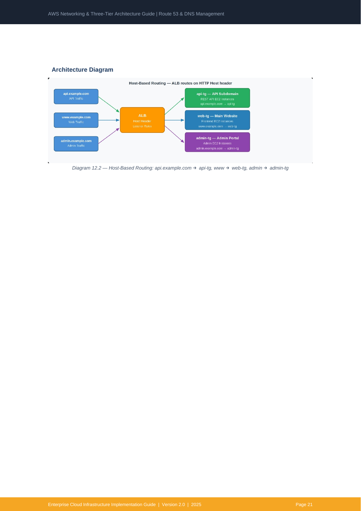

*Diagram 12.2 — Host-Based Routing: api.example.com → api-tg, www → web-tg, admin → admin-tg*

---

## TASK 11D — HTTP Request Method Routing
### Route requests based on the HTTP method — GET vs POST/PUT/DELETE

### Theory

HTTP method routing allows the ALB to direct read operations (GET) and write operations (POST, PUT, DELETE) to separate, purpose-optimised target groups. Read-heavy fleets can use cached replicas while write fleets are sized for consistency and throughput.

**Table 12.4 — HTTP Method Routing Rules**

| HTTP Method | Target Group | Purpose | Typical Instance |
|-------------|--------------|---------|-----------------|
| GET | read-tg | Read replicas, cached responses, data fetching | t3.medium × 5 (read-optimised) |
| POST | write-tg | Create operations, state-changing requests | m5.large × 3 (write-optimised) |
| PUT | write-tg | Update operations, resource modification | m5.large × 3 (write-optimised) |
| DELETE | write-tg | Delete operations, resource removal | m5.large × 3 (write-optimised) |

### Creating HTTP Method Listener Rules

| # | Step | Action / Detail |
|---|------|-----------------|
| 1 | Open Listeners | Select ALB → Listeners tab → Click HTTP:80 or HTTPS:443 listener |
| 2 | Add Rule | Click Manage rules → Add rule |
| 3 | Add Condition | Click + Add condition → choose HTTP request method |
| 4 | Set GET Rule | Method: GET → Forward to → read-tg → Priority: 1 |
| 5 | Add Write Rule | Add another rule → Methods: POST, PUT, DELETE → Forward to → write-tg → Priority: 2 |
| 6 | Default Rule | Keep default rule as-is (catch-all fallback) |
| 7 | Save | Click Save → read/write traffic now splits automatically |
| 8 | Monitor | Use ALB access logs and CloudWatch to verify traffic split between target groups |

### Architecture Diagram

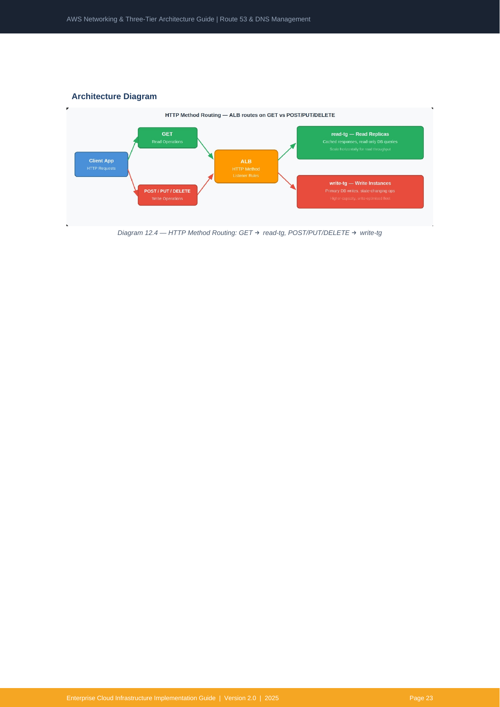

*Diagram 12.4 — HTTP Method Routing: GET → read-tg, POST/PUT/DELETE → write-tg*

---

## TASK 12 — AWS Certificate Manager (ACM)
### SSL/TLS, DNS Validation, HTTPS Listener

### Theory: SSL/TLS and ACM

SSL (Secure Sockets Layer) and its successor TLS (Transport Layer Security) are cryptographic protocols that provide end-to-end encryption between clients and servers. When a browser connects to an HTTPS endpoint, a TLS handshake occurs: the server presents its certificate, the client validates it against a trusted Certificate Authority (CA), and a symmetric session key is negotiated for encrypting the data transfer. AWS Certificate Manager (ACM) acts as a trusted CA, issuing free public certificates for your domains.

### Practical Implementation — AWS Console

| # | Step | Action / Detail |
|---|------|-----------------|
| 1 | Navigate | AWS Console → Certificate Manager (ACM) → Request a certificate |
| 2 | Certificate Type | Select Request a public certificate → Next |
| 3 | Domain Name | Enter domain: example.com and *.example.com (wildcard) |
| 4 | Validation | Select DNS validation (recommended over email) |
| 5 | Request | Click Request → Certificate status: Pending validation |
| 6 | DNS Records | Click certificate → Create records in Route 53 (auto-adds CNAME) → Takes 5–30 min |
| 7 | Wait | Status changes to Issued — certificate is now valid |
| 8 | Attach to ALB | EC2 → Load Balancers → Select ALB → Listeners → Add listener |
| 9 | HTTPS Listener | Protocol: HTTPS → Port: 443 → SSL certificate: select ACM cert → Forward to web-tg |
| 10 | HTTP Redirect | Edit HTTP:80 listener → Action: Redirect to HTTPS → 301 Permanent |

> **Note:** ACM certificates are free for use with AWS services (ALB, CloudFront, API Gateway). They auto-renew 60 days before expiry. Always use DNS validation for automated renewal.

### Architecture Diagram

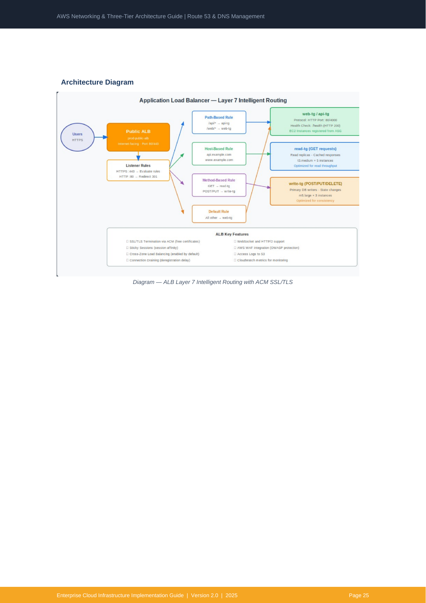

*Diagram — ALB Layer 7 Intelligent Routing with ACM SSL/TLS*

---

## TASK 13 — Three-Tier Architecture Implementation
### Web Tier, App Tier, Database Tier, Full Deployment

### Architecture Overview

The three-tier architecture separates presentation, application logic, and data storage into independent tiers, each with its own security group, subnet, and scaling policy — delivering maximum security, scalability, and fault tolerance.

**Table 14.1 — Three-Tier Architecture Components**

| Component | AWS Service | Subnet | Purpose |
|-----------|-------------|--------|---------|
| Public ALB | Application Load Balancer | Public | Receives HTTPS from internet, forwards to Web Tier |
| Web Tier (NGINX) | EC2 + ASG | Public | Serves static files, reverse proxies to App Tier via Internal ALB |
| Internal ALB | Application Load Balancer | Private | Routes internal traffic from Web to App Tier |
| App Tier (Node.js) | EC2 + ASG | Private | Business logic, reads/writes to MySQL EC2 |
| Database | MySQL Server on EC2 | Private | Persistent data store — self-managed MySQL on EC2 |
| NAT Gateway | NAT Gateway + EIP | Public | Outbound internet for private instances |
| Bastion Host | EC2 | Public | Secure SSH jump server for admin access |

### Complete Request Flow

| # | Step | Action / Detail |
|---|------|-----------------|
| 1 | User Request | Browser sends HTTPS GET request to https://www.example.com |
| 2 | DNS Resolution | Route 53 resolves domain → returns Public ALB DNS / IP |
| 3 | TLS Handshake | ALB presents ACM certificate → TLS session established |
| 4 | ALB Routing | Public ALB evaluates listener rules → forwards to web-tg (NGINX EC2) |
| 5 | NGINX Processing | NGINX receives request → serves static assets or reverse proxies to Internal ALB |
| 6 | Internal ALB | Internal ALB receives proxied request → evaluates rules → forwards to app-tg |
| 7 | App Tier | Node.js app processes request → executes business logic |
| 8 | DB Query | App connects to MySQL EC2 private IP on port 3306 → executes query |
| 9 | Response Path | DB → App → Internal ALB → NGINX → Public ALB → Client |

### Architecture Diagram

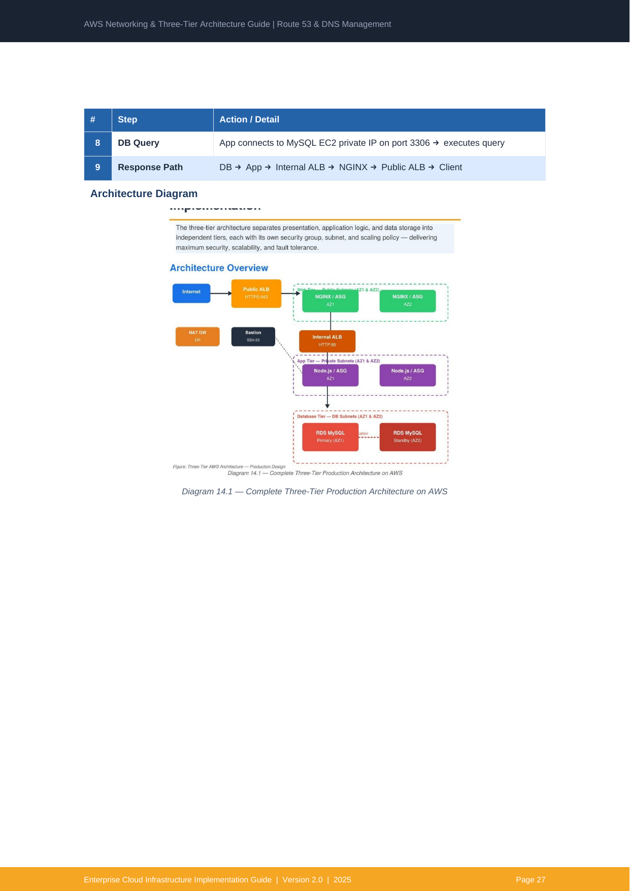

*Diagram 14.1 — Complete Three-Tier Production Architecture on AWS*

---

## TASK 13 — Three-Tier: Step-by-Step Implementation
### Phase 1: Database | Phase 2: App Tier | Phase 3: Web Tier

### Phase 1: Database Tier

| # | Step | Action / Detail |
|---|------|-----------------|
| 1 | Launch MySQL EC2 | EC2 → Launch Instance → Name: MySQL-DB → AMI: Ubuntu → Instance Type: t2.micro → Subnet: data-private-subnet-1a → Security Group: DB-SG → Launch |
| 2 | SSH into DB | SSH into Bastion: `ssh -i key.pem ubuntu@<bastion-public-ip>` → then SSH into DB: `ssh -i key.pem ubuntu@<db-private-ip>` |
| 3 | Install MySQL | `sudo apt update -y` → `sudo apt install mysql-server -y` → `sudo systemctl start mysql` → `sudo systemctl enable mysql` |
| 4 | Create DB & User | `sudo mysql` → `CREATE DATABASE productiondb;` → `CREATE USER 'appuser'@'%' IDENTIFIED BY 'password';` → `GRANT ALL PRIVILEGES ON productiondb.* TO 'appuser'@'%';` → `FLUSH PRIVILEGES;` |
| 5 | Configure App | Set: `DB_HOST=<db-private-ip>`, `DB_USER=appuser`, `DB_PASSWORD=password`, `DB_NAME=productiondb` → Restart: `node server.js` |
| 6 | Verify | From app tier: `mysql -h <db-private-ip> -u appuser -p productiondb` → confirm connection is successful |

### Phase 2: App Tier

| # | Step | Action / Detail |
|---|------|-----------------|
| 1 | App Launch Template | EC2 → Launch Templates → Create → Name: app-tier-lt → AL2023 → t3.small → Security Group: app-sg |
| 2 | App UserData | Install Node.js, clone app, set DB environment vars (DB_HOST=`<mysql-ec2-private-ip>`, DB_USER, DB_PASS) |
| 3 | App Target Group | Create target group: app-tg → Protocol HTTP, Port 3000 → Health: /health |
| 4 | Internal ALB | Create ALB → Name: prod-internal-alb → Scheme: Internal → Subnets: private-subnet-1a, 1b |
| 5 | Internal Listener | HTTP:80 → Forward to app-tg |
| 6 | App ASG | Create ASG: app-asg → Template: app-tier-lt → Subnets: private-subnet-1a, 1b → Attach app-tg → Min:2 Desired:2 Max:6 |

### Phase 3: Web Tier

| # | Step | Action / Detail |
|---|------|-----------------|
| 1 | NGINX Config | In web-tier-lt UserData, set proxy_pass to Internal ALB DNS name |
| 2 | Web Launch Template | Create web-tier-lt → AL2023 → t3.micro → Security Group: web-sg → NGINX |
| 3 | Web Target Group | Create web-tg → HTTP:80 → Health: /health |
| 4 | Public ALB | Create prod-public-alb → Internet-facing → public-subnet-1a, 1b → alb-sg |
| 5 | Public Listener | HTTP:80 → Forward to web-tg \| HTTPS:443 → ACM cert → web-tg |
| 6 | Web ASG | Create web-asg → web-tier-lt → public-subnet-1a, 1b → Attach web-tg → Min:2 Max:6 |
| 7 | DNS | Route 53 → Create A record → Alias → prod-public-alb DNS |

### NGINX Reverse Proxy Configuration

```nginx
server {
    listen 80;
    server_name _;

    location /health {
        return 200 "healthy\n";
        add_header Content-Type text/plain;
    }

    location /static/ {
        root /var/www/html;
        expires 7d;
    }

    location / {
        proxy_pass http://prod-internal-alb.us-east-1.elb.amazonaws.com;
        proxy_set_header Host $host;
        proxy_set_header X-Real-IP $remote_addr;
        proxy_set_header X-Forwarded-For $proxy_add_x_forwarded_for;
        proxy_set_header X-Forwarded-Proto $scheme;
    }
}
```

---

## 16 — AWS Route 53 & DNS-Based Traffic Management
### A Comprehensive Guide

### What is DNS?

The Domain Name System (DNS) is often referred to as the "phonebook of the internet." It translates human-readable domain names (like www.amazon.com) into machine-readable IP addresses (like 192.0.2.1 or 2001:db8::1) that computers use to identify each other on the network.

### Why is DNS Important?

Without DNS, users would have to remember complex numerical IP addresses for every website they want to visit. DNS provides a seamless, fast, and reliable way to navigate the internet. Modern DNS also provides traffic routing capabilities, allowing organizations to direct users to the most optimal servers based on geography, latency, or server health.

### Why AWS Created Route 53

AWS created Route 53 to provide a highly available and scalable cloud DNS web service. It was designed to give developers and businesses an extremely reliable and cost-effective way to route end users to internet applications by translating names into numeric IP addresses. It natively integrates with other AWS services, making it a foundational component for AWS cloud architectures.

| Term | Meaning |
|------|---------|
| "Route" | Refers to routing users to their requested internet applications. |
| "53" | Refers to TCP/UDP port 53, the standard port where DNS server requests are handled. |

### How Route 53 Works Internally

Amazon Route 53 works as an authoritative DNS service. When a user enters www.example.com in a browser, the browser sends a DNS query to a recursive DNS resolver. The resolver checks its cache; if not cached, it contacts the Root DNS Server → TLD server (.com) → Route 53 name servers → hosted zone → matching DNS record → returns IP or AWS resource target. This entire process happens within milliseconds.

---

## 17 — Route 53 Concepts Deep Dive

### Domain Registration

**Definition:** The process of purchasing and reserving a domain name (e.g., example.com) for a specific period through a domain registrar. Route 53 can act as a registrar.

**Best Practices:** Enable domain privacy protection. Enable auto-renewal. Lock the domain to prevent unauthorized transfers.

### Hosted Zones

A hosted zone is a container that holds information about how you want to route traffic for a specific domain and its subdomains.

- **Public Hosted Zone:** Contains records that determine how traffic is routed on the internet.
- **Private Hosted Zone:** Contains records that determine how traffic is routed within Amazon VPCs.

> **Note:** Route 53 assigns four unique name servers to each public hosted zone to ensure high availability. Keep internal microservices communication in Private Hosted Zones.

### DNS Record Types

**Table — DNS Record Types**

| Record Type | Description | Use Case |
|------------|-------------|----------|
| A Record | Maps a hostname to an IPv4 address | www.example.com → 1.2.3.4 |
| AAAA Record | Maps a hostname to an IPv6 address | www.example.com → 2001:db8::1 |
| CNAME | Maps a hostname to another hostname (not for root domain) | blog.example.com → example.wordpress.com |
| Alias | Route 53 extension — maps to AWS resources dynamically | example.com → ALB DNS name |
| MX Record | Specifies mail servers for the domain | Mail routing |
| TXT Record | Text information, domain verification, SPF/DKIM/DMARC | Email security |
| NS Record | Delegates a DNS zone to authoritative name servers | Zone delegation |
| SOA Record | Administrative info about the zone | Zone management |

### TTL (Time To Live)

A value in a DNS record that tells DNS resolvers how long (in seconds) they should cache the record before asking the authoritative server for an update.

- **Lower TTL (60 seconds):** Use before migrating servers or making big DNS changes — faster propagation.
- **Higher TTL (86400 seconds / 24 hours):** Use for static records to reduce cost and improve performance.

### Alias Records

A Route 53-specific extension to DNS. It allows you to map a hostname directly to an AWS resource (like an ALB, CloudFront distribution, or S3 bucket) without using an IP address or a CNAME. Critically, Alias records work at the Zone Apex (e.g., example.com) where CNAMEs are forbidden by DNS standards. Alias queries to AWS resources are also free.

### Health Checks

Route 53 can actively monitor the health and performance of your applications, web servers, and other resources. Route 53 health checkers (located globally) send requests via HTTP, HTTPS, or TCP to endpoints at regular intervals. If an endpoint fails consecutive checks, it is marked unhealthy and traffic is no longer routed to it.

---

## 18 — Route 53 Routing Policies

**Table — Route 53 Routing Policy Comparison**

| Policy | How It Works | Real-World Analogy | Best Use Case |
|--------|-------------|-------------------|---------------|
| Simple Routing | Routes traffic to a single resource. Can return multiple IPs with no special logic. | A standard phonebook entry — one name, one number. | Simple single-server setups, development environments |
| Weighted Routing | Routes traffic to multiple resources in proportions you specify (e.g., 80% / 20%). | A traffic cop directing most cars down the main highway and a few down a bypass. | A/B testing, blue-green deployments, canary releases |
| Latency Routing | Routes users to the AWS region that provides the lowest latency. | Calling a toll-free number and being routed to the nearest regional call center. | Global applications needing optimal performance |
| Failover Routing | Routes to primary when healthy; switches to secondary when primary fails health checks. | A backup generator turning on when the main power grid fails. | Active-passive disaster recovery |
| Geolocation Routing | Routes based on the geographic location of users (continent, country, US state). | A website showing prices in Euros to European visitors, Dollars to US visitors. | Content localization, data residency compliance, geo-blocking |
| Geoproximity Routing | Routes based on location of users AND resources with adjustable bias. Requires Traffic Flow. | Adjusting radio tower broadcast power to shift coverage areas. | Complex geographic load balancing with manual traffic shifting |
| Multi-Value Answer | Returns up to 8 healthy IPs to a DNS query, filtering out unhealthy ones. | Giving a customer a list of open store locations, removing any that are closed. | Basic DNS-level load balancing without a dedicated ALB |

---

## 19 — Practical Implementation — Route 53 Tasks

### TASK R1 — Create a Hosted Zone
**Establish the DNS management workspace for a new domain**

**Use case:** A company purchased mycloudapp.com from a third-party registrar (like GoDaddy) and wants AWS Route 53 to manage its DNS.

| # | Step | Action / Detail |
|---|------|-----------------|
| 1 | Navigate | Navigate to Route 53 in the AWS Console |
| 2 | Create Zone | Click Hosted zones → Create hosted zone |
| 3 | Enter Domain | Enter Domain name: mycloudapp.com |
| 4 | Type | Type: Public hosted zone |
| 5 | Create | Click Create hosted zone |
| 6 | Note NS Records | Note the 4 NS (Name Server) records generated |
| 7 | Update Registrar | Log into your domain registrar (e.g., GoDaddy) and replace their default name servers with these 4 AWS name servers |

> **Note:** DNS propagation can take anywhere from 15 minutes to 48 hours after updating NS records at the registrar.

---

### TASK R2 — Simple Routing Policy
**Point a domain to a single server**

**Use case:** A startup hosts a small static website on a single EC2 instance with an Elastic IP.

| # | Step | Action / Detail |
|---|------|-----------------|
| 1 | Open Hosted Zone | Open your Hosted Zone. Click Create record |
| 2 | Routing Policy | Routing policy: Simple routing |
| 3 | Record Name | Record name: Leave blank (for root domain) |
| 4 | Record Type | Record type: A - Routes traffic to an IPv4 address |
| 5 | Value | Value: Enter the Elastic IP of the EC2 instance (e.g., 203.0.113.50) |
| 6 | TTL | TTL: 300 |
| 7 | Create | Click Create records |

> **Note:** Do NOT use Simple Routing for production applications requiring high availability or fault tolerance — a server failure means complete downtime.

### Architecture Diagram

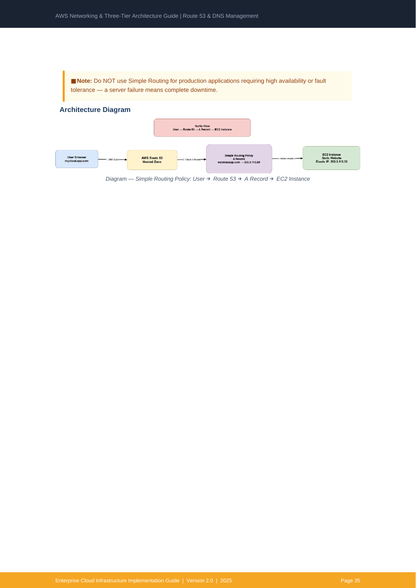

*Diagram — Simple Routing Policy: User → Route 53 → A Record → EC2 Instance*

---

### TASK R3 — Alias Record with Application Load Balancer
**Securely and scalably point a root domain to a load balancer**

**Use case:** A production website uses an ALB in front of private EC2 instances spanning multiple Availability Zones. CNAMEs cannot be used on the root domain, and a standard A record won't work because AWS load balancers frequently change their underlying IP addresses.

| # | Step | Action / Detail |
|---|------|-----------------|
| 1 | Create Record | Create record → Simple routing |
| 2 | Record Name | Record name: Leave blank |
| 3 | Record Type | Record type: A |
| 4 | Enable Alias | Toggle 'Alias' to enabled |
| 5 | Route Traffic To | Route traffic to: Alias to Application and Classic Load Balancer |
| 6 | Select ALB | Choose Region, then select your ALB from the dropdown |
| 7 | Create | Click Create records |

> **Note:** Route 53 automatically tracks the dynamic IP addresses of the ALB. If AWS scales the ALB and changes its IPs, Route 53 returns the new IPs without any manual intervention. Alias lookups within AWS are free.

### Architecture Diagram

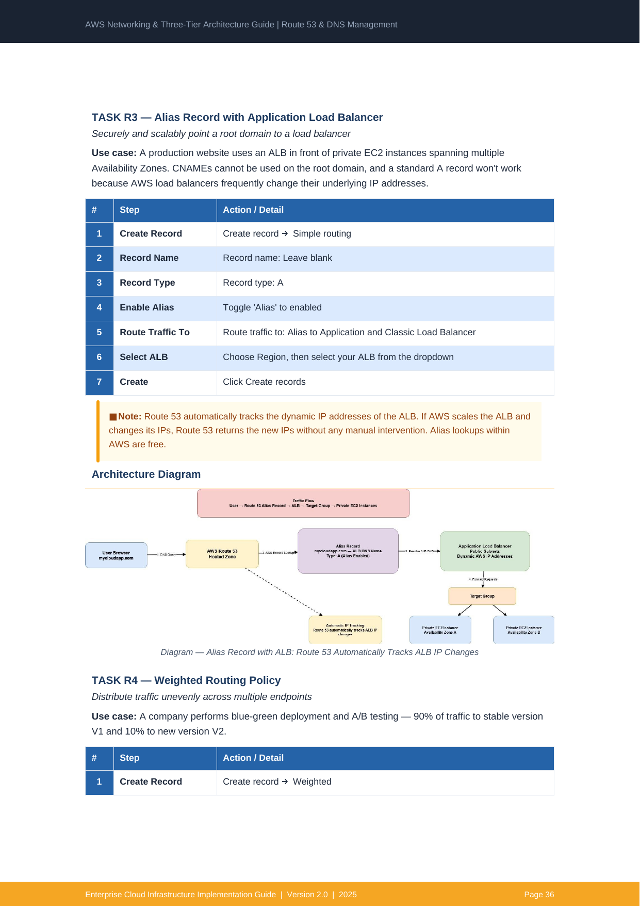

*Diagram — Alias Record with ALB: Route 53 Automatically Tracks ALB IP Changes*

---

### TASK R4 — Weighted Routing Policy
**Distribute traffic unevenly across multiple endpoints**

**Use case:** A company performs blue-green deployment and A/B testing — 90% of traffic to stable version V1 and 10% to new version V2.

| # | Step | Action / Detail |
|---|------|-----------------|
| 1 | Create Record | Create record → Weighted |
| 2 | Record 1 (V1) | Name: app.mycloudapp.com. Value: IP/ALB of V1. Weight: 90. Record ID: V1-Stable |
| 3 | Record 2 (V2) | Name: app.mycloudapp.com (must match). Value: IP/ALB of V2. Weight: 10. Record ID: V2-Canary |
| 4 | Create | Click Create records |
| 5 | Monitor | Monitor CloudWatch metrics for V2. If errors spike, change V2 weight to 0 and V1 to 100 for instant rollback |

### Architecture Diagram

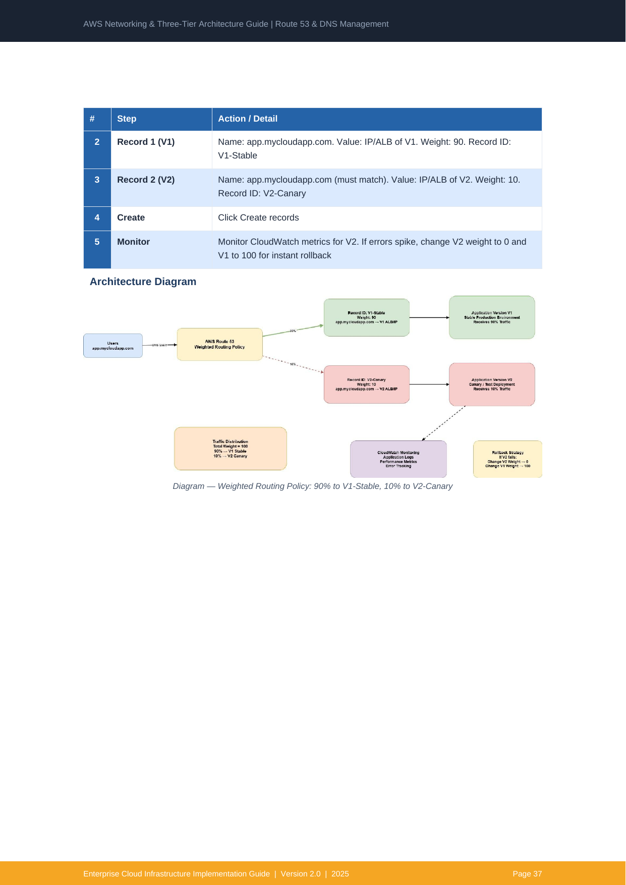

*Diagram — Weighted Routing Policy: 90% to V1-Stable, 10% to V2-Canary*

---

### TASK R5 — Latency-Based Routing
**Route users to the server that will respond the fastest**

**Use case:** A global application serves users from multiple AWS regions — ap-south-1 (Mumbai) and us-east-1 (N. Virginia).

| # | Step | Action / Detail |
|---|------|-----------------|
| 1 | Create Record | Create record → Latency |
| 2 | Mumbai Record | Name: global.mycloudapp.com. Region: ap-south-1. Value: Mumbai ALB. Record ID: Mumbai-Region |
| 3 | Virginia Record | Name: global.mycloudapp.com. Region: us-east-1. Value: Virginia ALB. Record ID: Virginia-Region |
| 4 | Create | Click Create records |

> **Note:** A user in Delhi will be routed to Mumbai (~30ms latency), while a user in New York will be routed to N. Virginia (~20ms). Route 53 checks its latency database based on the user's DNS resolver IP.

### Architecture Diagram

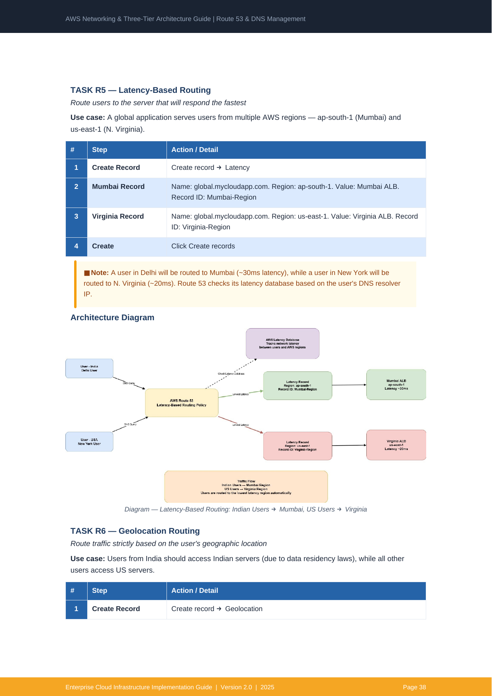

*Diagram — Latency-Based Routing: Indian Users → Mumbai, US Users → Virginia*

---

### TASK R6 — Geolocation Routing
**Route traffic strictly based on the user's geographic location**

**Use case:** Users from India should access Indian servers (due to data residency laws), while all other users access US servers.

| # | Step | Action / Detail |
|---|------|-----------------|
| 1 | Create Record | Create record → Geolocation |
| 2 | India Record | Name: www.mycloudapp.com. Location: Country - India. Value: Mumbai ALB. Record ID: India-Users |
| 3 | Default Record | Name: www.mycloudapp.com. Location: Default. Value: Virginia ALB. Record ID: Rest-of-World |
| 4 | Create | Click Create records |

> **Note:** The Default record is mandatory — it acts as a catch-all for any user whose IP doesn't map to a defined geography.

### Architecture Diagram

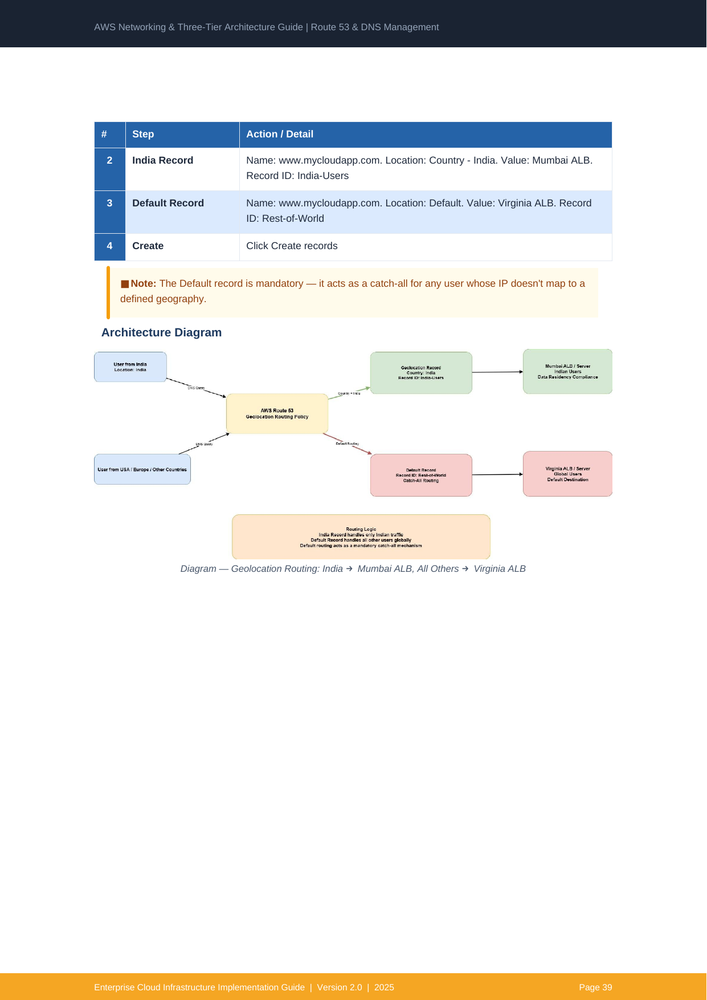

*Diagram — Geolocation Routing: India → Mumbai ALB, All Others → Virginia ALB*

---

### TASK R7 — Failover Routing with Health Checks
**Automatically redirect traffic if the primary system crashes**

**Use case:** A banking application requires highly available disaster recovery (Active-Passive).

| # | Step | Action / Detail |
|---|------|-----------------|
| 1 | Create Health Check | Health checks → Create health check. Monitor the primary ALB endpoint |
| 2 | Open Hosted Zone | Go to Hosted Zone → Create record → Failover |
| 3 | Primary Record | Name: bank.mycloudapp.com. Failover type: Primary. Value: Primary ALB. Health check: HC created in step 1. Record ID: Primary-DC |
| 4 | Secondary Record | Name: bank.mycloudapp.com. Failover type: Secondary. Value: Backup/Static S3 Site. Record ID: DR-Site |
| 5 | Create | Click Create records |

> **Note:** Route 53 constantly pings the Primary ALB. After 3 consecutive failures, it stops returning the Primary IP and starts returning the Secondary IP. When the Primary recovers, traffic automatically switches back.

### Architecture Diagram

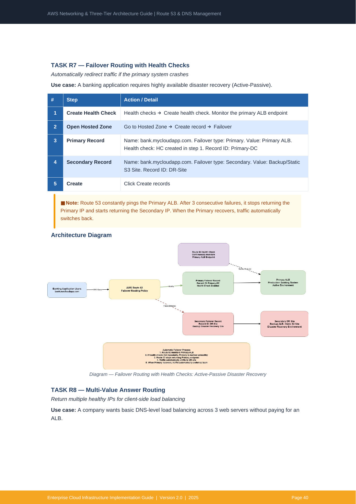

*Diagram — Failover Routing with Health Checks: Active-Passive Disaster Recovery*

---

### TASK R8 — Multi-Value Answer Routing
**Return multiple healthy IPs for client-side load balancing**

**Use case:** A company wants basic DNS-level load balancing across 3 web servers without paying for an ALB.

| # | Step | Action / Detail |
|---|------|-----------------|
| 1 | Create Health Checks | Create 3 health checks, one for each EC2 instance IP (HC1, HC2, HC3) |
| 2 | Create Record | Create record → Multi-value answer |
| 3 | Server 1 | Name: api.mycloudapp.com. Value: IP 1. Health check: HC1. Record ID: Server1 |
| 4 | Server 2 | Name: api.mycloudapp.com. Value: IP 2. Health check: HC2. Record ID: Server2 |
| 5 | Server 3 | Name: api.mycloudapp.com. Value: IP 3. Health check: HC3. Record ID: Server3 |

> **Note:** When a user queries api.mycloudapp.com, Route 53 checks health. If Server 2 is down, Route 53 returns ONLY IP 1 and IP 3. The client's browser/OS picks one randomly to connect to.

### Architecture Diagram

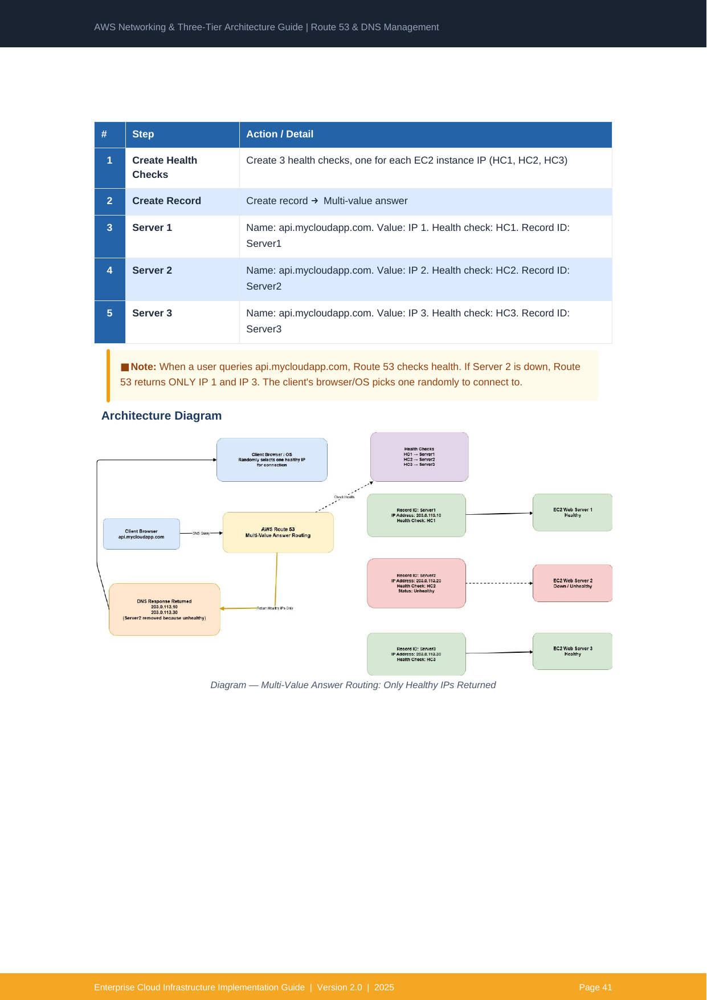

*Diagram — Multi-Value Answer Routing: Only Healthy IPs Returned*

---

## 20 — Complete Production Architecture
### Route 53 → ALB → VPC → ASG → Private EC2 Instances

To truly understand Route 53, it must be viewed as the front door to a secure, scalable VPC architecture. The following describes how all components work together.

### Architecture Diagram

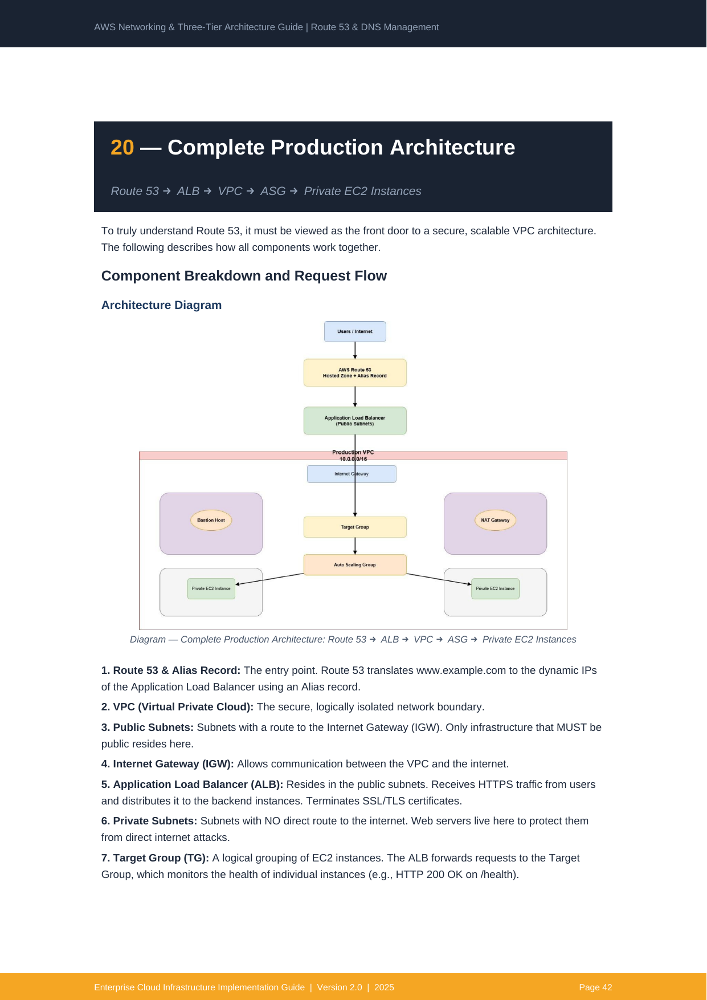

*Diagram — Complete Production Architecture: Route 53 → ALB → VPC → ASG → Private EC2 Instances*

### Component Breakdown and Request Flow

1. **Route 53 & Alias Record:** The entry point. Route 53 translates www.example.com to the dynamic IPs of the Application Load Balancer using an Alias record.
2. **VPC (Virtual Private Cloud):** The secure, logically isolated network boundary.
3. **Public Subnets:** Subnets with a route to the Internet Gateway (IGW). Only infrastructure that MUST be public resides here.
4. **Internet Gateway (IGW):** Allows communication between the VPC and the internet.
5. **Application Load Balancer (ALB):** Resides in the public subnets. Receives HTTPS traffic from users and distributes it to the backend instances. Terminates SSL/TLS certificates.
6. **Private Subnets:** Subnets with NO direct route to the internet. Web servers live here to protect them from direct internet attacks.
7. **Target Group (TG):** A logical grouping of EC2 instances. The ALB forwards requests to the Target Group, which monitors the health of individual instances (e.g., HTTP 200 OK on /health).
8. **Auto Scaling Group (ASG):** Manages the EC2 instances. Ensures a minimum number of instances are always running (self-healing) and scales out when CPU/traffic spikes.
9. **Private EC2 Instances:** The actual web/app servers processing the requests.
10. **NAT Gateway:** Resides in the public subnet. Allows private EC2 instances to initiate outbound connections to the internet (e.g., software updates) without allowing inbound internet traffic.
11. **Bastion Host (Jump Box):** A hardened EC2 instance in the public subnet used strictly for SSH access by administrators.
12. **Security Groups:** Stateful firewalls at the instance level. ALB SG allows Inbound 443/80 from 0.0.0.0/0. EC2 SG allows Inbound 80 ONLY from the ALB SG; SSH ONLY from the Bastion SG.

### Production Scenarios

#### Scenario A: SaaS Platform — High Availability & Latency Optimization

A SaaS platform serving users globally utilizes Latency-Based Routing. Route 53 directs European users to the eu-central-1 deployment and US users to us-east-1. In each region, traffic hits an ALB backed by an ASG spanning 3 Availability Zones. Database replication occurs across regions using Aurora Global Database.

#### Scenario B: Banking Application — Extreme Fault Tolerance

A bank prioritizes uptime using Failover Routing. The Primary record points to an active data center in AWS. Route 53 Health Checks constantly monitor the login API. If the API fails, Route 53 triggers a failover to a Secondary record pointing to a disaster recovery region. The DR region runs a scaled-down pilot light architecture that rapidly scales up upon receiving traffic.

#### Scenario C: E-commerce Platform — Traffic Shaping & Deployments

During a major UI overhaul, an E-commerce site uses Weighted Routing. They deploy the new UI to a separate fleet of EC2 instances. Route 53 is configured to send 95% of traffic to the legacy site and 5% to the new site. Product managers analyze conversion rates. Over a week, the weights are adjusted (80/20, 50/50, 0/100) until the new site handles all traffic safely.

---

*Enterprise Cloud Infrastructure Implementation Guide | Version 2.0 | 2025*
